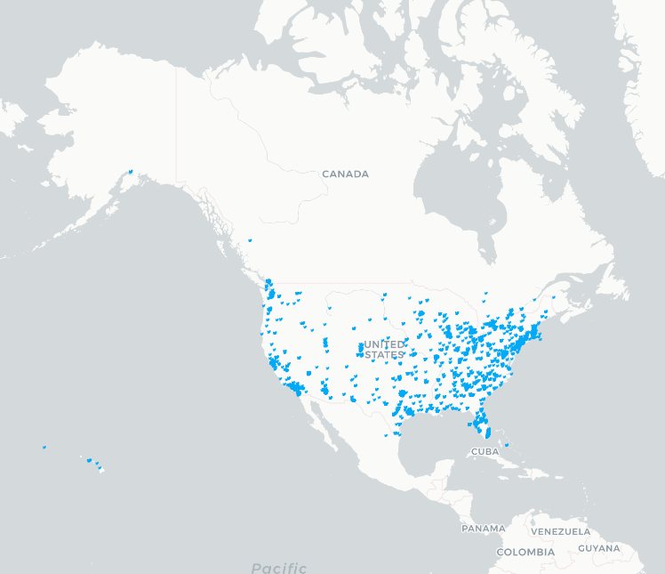
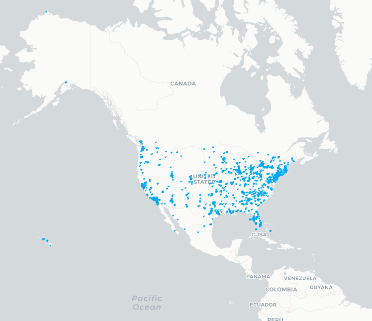
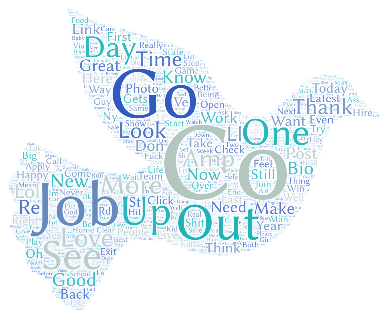
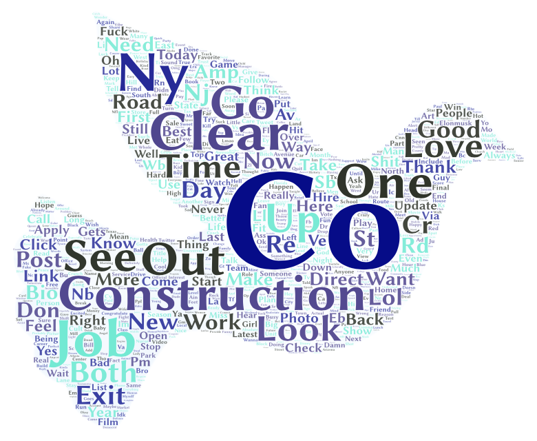

# Geo-Tagged Tweets Collected 24 Hours Apart

## Intentions
The intention of this project is to visualize geo-tagged tweets using an API-based crawler for an undergraduate course assignment. The data are filtered by tweets geo-tagged within the United States. Additionally, the crawler was set to run for 10 minutes. This process was conducted a total of two times 24 hours apart. I wanted to see if there would be notable differences in the geo-tagged locations and content of tweets harvested 24 hours apart. The purpose of these two maps is to see the geological shift in the popular geo-tagged areas on different days. With the word clouds, we are also able to see which words were most popular among tweets for each given day.

## Files
The first data were harvested at 1:30pm April 20st, 2022 while the second were harvested at 1:30pm on April 21st, 2022. The data was collected with the zoedooley_geosearch.ipynb file. Within this repository there are two data files under the assets tab. There are also two images of the maps created for each day in addition to two images showing the two wordclouds generated for each day under the img tab. The names of the files are consistent with the day that they are depicting data from. The data collected on 4/20/22 is associated with the number 1 while the data colelcted on 4/21/22 is associated with the number 2. 

## Map Comparison
    
    
Both maps were created with the intention of each blue bird icon representing a single tweet. Areas that contain more geo-tagged tweets will appear to be a dense array of bird icons. Map 1 and Map 2 appear to be very similar. One slight difference in the two maps is that the areas where there is a high density of geo-tagged tweets seem to be slightly more dense on Map 2 than Map 1. Map 1 also appears to have some geo-tagged tweets in Canada while Map 2 has some geo-tagged tweets in Mexico, which is bound to happen due to the filtering by corner coordinates of the US. 

## Word Cloud Comparison
    
    
Word Cloud 1 and Word Cloud 2 both have the same three most popular words: "Co", "Job", and "Go". As I collected data on two different week days, it makes sense that these two word clouds share these common words. Word Cloud 1 also contains words like: "See", "One", "Out", and "Up". Overall, the theme for Word Cloud 1 appeared to be anything related to jobs, applications, and hiring. A lot of the tweets harvested on this day were likely job ads posted by companies or recruiters. Word Cloud 2 contains other words like: "Look", "Construction", "Ny", and "One". The theme for Word Cloud 2 appears to be more closely related to sports and road construction. Because of this I think it's likely that there were some road closures on popular routes in New York that were being tweeted about. 
